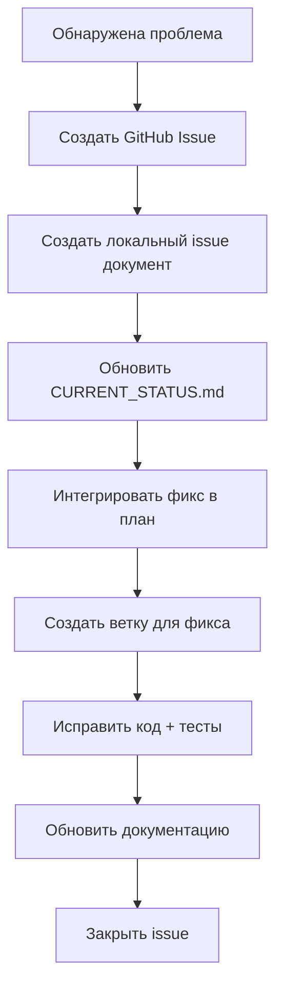

# Управление Issues в URMS-OS

## 🎯 Процесс работы с проблемами

### Когда находим баг или проблему:



### Детальные шаги:

#### Шаг 1: Создание Issue
```bash
# Создать GitHub Issue с шаблоном
# Создать локальный документ в docs/development/issues/
cp docs/development/issues/BUG_REPORT_TEMPLATE.md docs/development/issues/YYYY-MM-DD_problem_name.md
```

#### Шаг 2: Обновление статуса
- Обновить `CURRENT_STATUS.md` в разделе "Активные проблемы"
- Указать приоритет и влияние на разработку

#### Шаг 3: Интеграция в план
- Обновить соответствующий план в `docs/development/plans/`
- Добавить задачу фикса или обновить существующие

#### Шаг 4: Разработка фикса
```bash
# Создать ветку для фикса
git checkout -b fix/краткое-описание-проблемы

# Реализовать исправление
# Добавить тесты
# Обновить документацию
```

#### Шаг 5: Завершение
- Создать PR и пройти code review
- Обновить отчет о завершении этапа
- Закрыть GitHub Issue

## 📊 Приоритеты Issues

| Приоритет | Описание | Время реакции |
|-----------|----------|---------------|
| 🔴 **CRITICAL** | Блокирует разработку, система не работает | 24 часа |
| 🟡 **HIGH** | Существенно влияет на функциональность | 3 дня |
| 🟢 **MEDIUM** | Влияет на отдельные функции | 1 неделя |
| 🔵 **LOW** | Улучшения, косметические проблемы | 2 недели |

## 📁 Структура Issue документа

Каждый issue документ должен содержать:

```markdown
# Issue: [Краткое описание]

**Created:** YYYY-MM-DD  
**Priority:** [CRITICAL/HIGH/MEDIUM/LOW]  
**Status:** [New/Investigating/In Progress/Resolved]  
**Component:** [email/ticket/ai/etc]  
**Milestone:** [Phase X]

## Problem Description
[Что происходит?]

## Technical Analysis
[Корневая причина, затронутые компоненты]

## Solution Strategy
[Предлагаемое решение, связанные задачи]

## Related Documents
[Ссылки на отчеты, планы, спецификации]
```

## 🔄 Связь с архитектурными принципами

Все fixes должны соответствовать:
- Hexagonal Architecture принципам
- "No Vendor Lock-in" философии  
- Правилам кодирования из AI_CODING_GUIDELINES.md

---

**Maintainer**: URMS-OS Architecture Committee  
**Last Updated**: 2025-10-16
